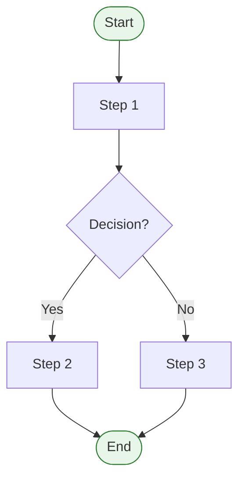
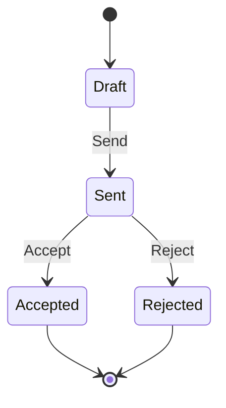
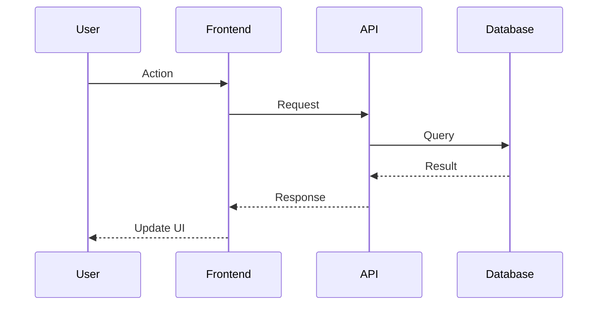
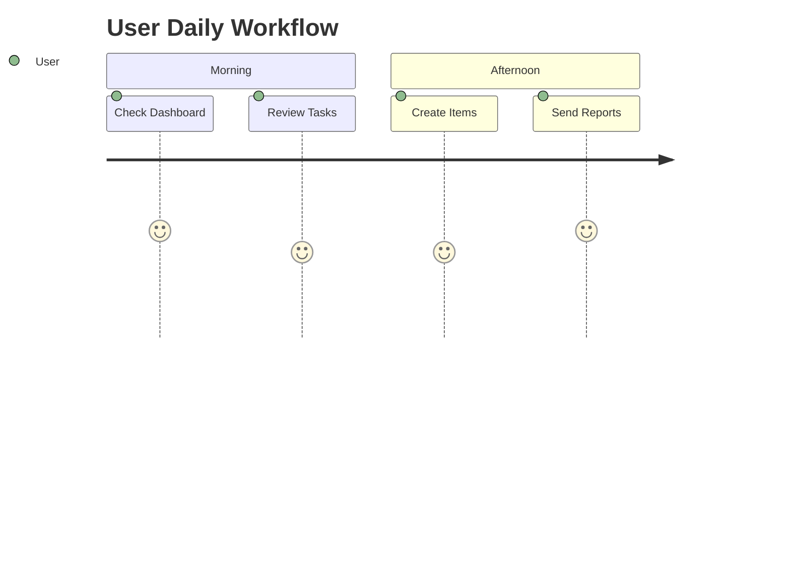

# Generate Workflow Diagrams

Generate interactive Mermaid flowchart diagrams as an HTML file for visualizing application workflows.

## Variables

output_path: $1 (optional - defaults to "ai_docs/KOMPASS_WORKFLOW_DIAGRAMS.html")

## Instructions

### 1. Analyze Application Workflows

Research the codebase to understand key workflows:

```bash
# Check status types and flows
grep -r "status" apps/Client/src/types/kompass.ts | head -30

# Check pipeline stages
grep -r "pipeline\|Pipeline" apps/Client/src/ --include="*.ts" --include="*.tsx" | head -20

# Check quotation workflow
cat apps/Client/src/pages/kompass/QuotationCreatorPage.tsx | head -100

# Check import workflow
cat apps/Client/src/pages/kompass/ImportWizardPage.tsx | head -100
```

### 2. Identify Key Diagrams Needed

Generate diagrams for:

1. **System Overview** - High-level architecture (Frontend → Backend → Database)
2. **Data Model** - Entity relationship diagram showing table connections
3. **Quotation Creation Workflow** - Step-by-step quotation process
4. **Quotation Status Flow** - State diagram for quotation statuses
5. **Client Pipeline** - CRM stages from Lead to Won/Lost
6. **Product Import Workflow** - AI extraction process
7. **Portfolio Creation Workflow** - Building and sharing portfolios
8. **Pricing Calculation Flow** - FOB to final COP calculation
9. **User Journey Maps** - Daily workflows for each persona
10. **API Request Flow** - Sequence diagrams for key operations

### 3. Generate HTML File

Create an HTML file with embedded Mermaid diagrams:

```html
<!DOCTYPE html>
<html lang="en">
<head>
    <meta charset="UTF-8">
    <meta name="viewport" content="width=device-width, initial-scale=1.0">
    <title>Kompass Workflow Diagrams</title>
    <script src="https://cdn.jsdelivr.net/npm/mermaid/dist/mermaid.min.js"></script>
    <style>
        /* Clean, professional styling */
        body { font-family: system-ui, sans-serif; background: #f5f5f5; }
        .container { max-width: 1400px; margin: 0 auto; padding: 20px; }
        header { background: linear-gradient(135deg, #1976d2, #1565c0); color: white; padding: 40px; border-radius: 12px; }
        .diagram-section { background: white; padding: 30px; border-radius: 12px; margin: 30px 0; box-shadow: 0 2px 8px rgba(0,0,0,0.1); }
        .mermaid { display: flex; justify-content: center; margin: 20px 0; }
        .legend { background: #f5f5f5; padding: 15px; border-radius: 8px; margin-top: 20px; }
    </style>
</head>
<body>
    <div class="container">
        <!-- Diagrams go here -->
    </div>
    <script>
        mermaid.initialize({ startOnLoad: true, theme: 'default' });
    </script>
</body>
</html>
```

### 4. Mermaid Diagram Types to Use

Use appropriate diagram types:

- **flowchart TB/LR** - Process flows, workflows
- **stateDiagram-v2** - Status transitions
- **erDiagram** - Data model relationships
- **sequenceDiagram** - API request/response flows
- **journey** - User journey maps
- **graph** - Simple hierarchies

### 5. Diagram Standards

Follow these standards for each diagram:

- **Colors**: Use consistent color scheme
  - Primary actions: #1976d2 (blue)
  - Success states: #2e7d32 (green)
  - Warning states: #ed6c02 (orange)
  - Error states: #d32f2f (red)

- **Labels**: Clear, concise text
- **Grouping**: Use subgraphs for logical groupings
- **Notes**: Add explanatory notes where helpful
- **Legend**: Include color/symbol legend for complex diagrams

### 6. Copy to Public Folder

After generating, copy to the public folder for in-app access:

```bash
mkdir -p apps/Client/public/docs
cp ai_docs/KOMPASS_WORKFLOW_DIAGRAMS.html apps/Client/public/docs/
```

### 7. Validation

Verify the HTML file:

```bash
# Check file exists and has content
ls -la ai_docs/KOMPASS_WORKFLOW_DIAGRAMS.html
wc -l ai_docs/KOMPASS_WORKFLOW_DIAGRAMS.html

# Check it's valid HTML (basic check)
head -20 ai_docs/KOMPASS_WORKFLOW_DIAGRAMS.html

# Verify public copy
ls -la apps/Client/public/docs/
```

## Diagram Templates

### Flowchart Template


### State Diagram Template


### Sequence Diagram Template


### Journey Map Template


## Report

When complete, output:

```
Workflow diagrams generated:
- ai_docs/KOMPASS_WORKFLOW_DIAGRAMS.html (X lines)
- apps/Client/public/docs/KOMPASS_WORKFLOW_DIAGRAMS.html (copied)

Diagrams included:
1. System Overview
2. Data Model (ER Diagram)
3. Quotation Creation Workflow
4. Quotation Status Flow
5. Client Pipeline
6. Product Import Workflow
7. Portfolio Creation Workflow
8. Pricing Calculation Flow
9. User Journey Maps
10. API Request Flow

Open in browser: file:///path/to/ai_docs/KOMPASS_WORKFLOW_DIAGRAMS.html
```
